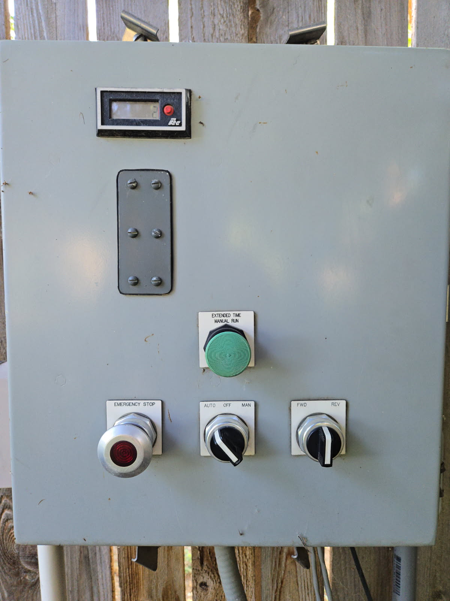
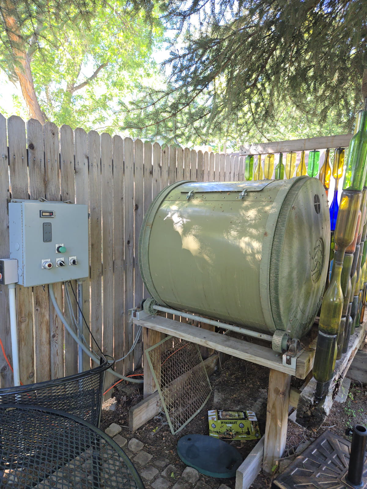
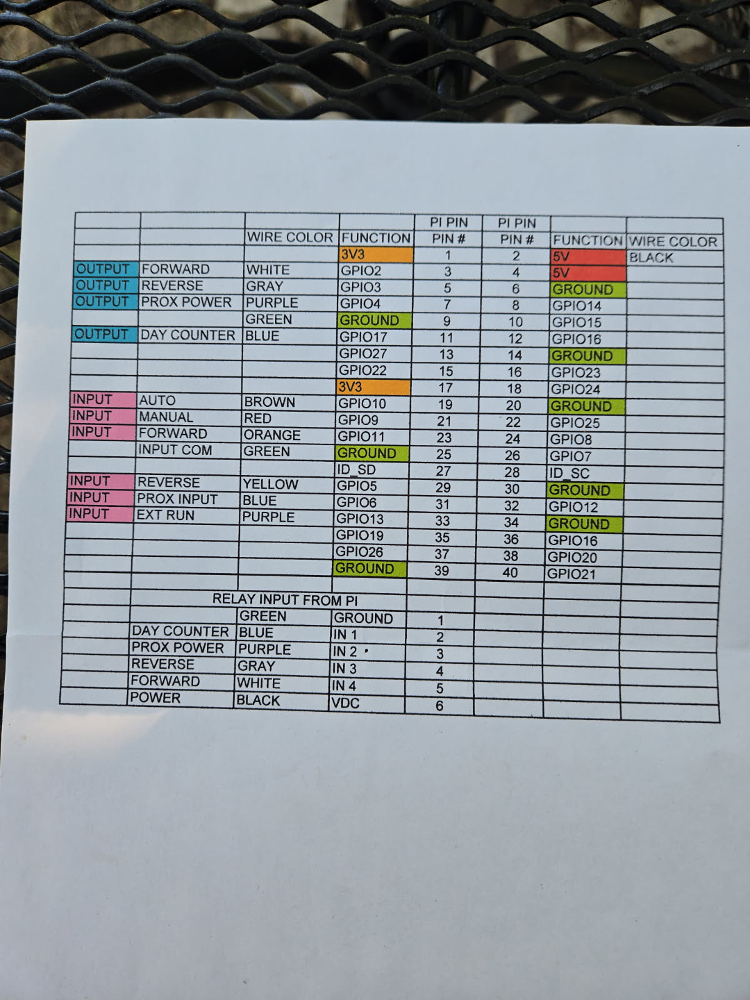

# RotBot v1.0

```
  _______     ______  ___________      _______     ______  ___________ 
 /"      \   /    " \("     _   ")    |   _  "\   /    " \("     _   ")
|:        | // ____  \)__/  \\__/     (. |_)  :) // ____  \)__/  \\__/ 
|_____/   )/  /    ) :)  \\_ /        |:     \/ /  /    ) :)  \\_ /    
 //      /(: (____/ //   |.  |        (|  _  \\(: (____/ //   |.  |    
|:  __   \ \        /    \:  |        |: |_)  :)\        /    \:  |    
|__|  \___) \"_____/      \__|        (_______/  \"_____/      \__|    
```

- A Skinner Project


## Introduction

Rotbot is a simple program designed to control a drum composter through a stepper motor. It is intended to be run as a systemd service on a Raspberry Pi, allowing for easy control and automation of the composting process.  It provides a manual and automatic mode for rotating the composter.

## Dependencies

Rotbot is designed to be run on a raspberry pi using the gpio_zero library.  See https://gpiozero.readthedocs.io/en/latest/ for more information.

## Installation

* Copy the file service/rotbot.service into /etc/systemd/system/rotbot.service

* Ensure that the workingDirectory and ExecStart variables in rotbot.py are set correctly for your system.

* Run the following commands to enable and start the service:

```bash
sudo systemctl enable rotbot.service
sudo systemctl start rotbot.service
```

## Pictures




